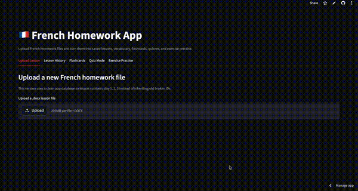

# French Homework App 🇫🇷

**Live App:** [french-homework-app-mrponyrivers.streamlit.app](https://french-homework-app-mrponyrivers.streamlit.app/)  
**GitHub Repo:** [mrponyrivers / French-Homework-App](https://github.com/mrponyrivers/French-Homework-App)  
**Demo Video:** [Watch on YouTube](https://youtu.be/Ut5uSW3ZgXI)

A Streamlit app that turns uploaded French homework `.docx` files into structured study tools.

---

## Demo

[](https://youtu.be/Ut5uSW3ZgXI)

---

## Overview

This project helps turn French homework documents into:

- saved lessons
- extracted exercises
- vocabulary study material
- flashcards
- vocabulary quiz mode
- exercise quiz mode
- exercise practice

It is designed to work with both:

- vocabulary tables
- fill-in-the-blank homework lessons with answers in parentheses

---

## Features

- Upload French homework `.docx` files
- Extract lesson text
- Extract Word tables
- Save lessons locally
- Parse fill-in-the-blank exercises
- Detect answers written in parentheses
- Carry section instructions into grouped exercises
- Support vocabulary-based flashcards
- Support vocabulary quiz mode
- Support exercise quiz mode
- Support exercise practice mode
- Browse saved lesson history
- Delete selected lessons

---

## Example Supported Formats

### Vocabulary table lessons

| French | English |
|--------|---------|
| le     | the     |
| être   | to be   |

### Fill-in-the-blank lessons

```text
Exercise 1. Complete. Choisis le bon mot: je, tu, il, elle
_ suis etudiant. (Je)
_t’appelles comment? (Tu)
_est mon frere. (Il)
_est ma soeur. (Elle)
```

---

## Tech Stack

- Python
- Streamlit
- SQLite
- python-docx
- pandas
- lxml

---

## How It Works

1. Upload a French homework `.docx` file
2. The app extracts lesson text, exercises, and vocabulary
3. Lessons are saved for review in Lesson History
4. Vocabulary items can be studied with flashcards and quiz mode
5. Fill-in-the-blank exercises can be practiced in Exercise Practice and Exercise Quiz

---

## Run Locally

### 1. Create and activate a virtual environment

```bash
python3 -m venv .venv
source .venv/bin/activate
```

### 2. Install dependencies

```bash
python3 -m pip install -r requirements.txt
```

### 3. Run the app

```bash
python3 -m streamlit run app.py
```

---

## Project Structure

```text
french-homework-app/
├── app.py
├── README.md
├── requirements.txt
├── assets/
├── modules/
│   ├── db.py
│   ├── parser.py
│   ├── quiz.py
│   ├── storage.py
│   └── utils.py
```

---

## Why I Built This

I built this project to practice turning messy real-world documents into structured study workflows.

This app helped me work on:

- parsing document content
- handling edge cases in homework formatting
- organizing extracted data into study tools
- building a usable Streamlit interface
- managing local app storage with SQLite

---

## Future Improvements

- stronger vocabulary extraction from non-table lessons
- lesson tagging and categories
- progress tracking
- multiple-choice quiz mode
- review history and scoring improvements

---

## Links

- **Live App:** [french-homework-app-mrponyrivers.streamlit.app](https://french-homework-app-mrponyrivers.streamlit.app/)
- **GitHub Repo:** [mrponyrivers / French-Homework-App](https://github.com/mrponyrivers/French-Homework-App)
- **YouTube Demo:** [Watch here](https://youtu.be/Ut5uSW3ZgXI)

---

## Author

Built by **Pony Rivers**  
GitHub: [mrponyrivers](https://github.com/mrponyrivers)
